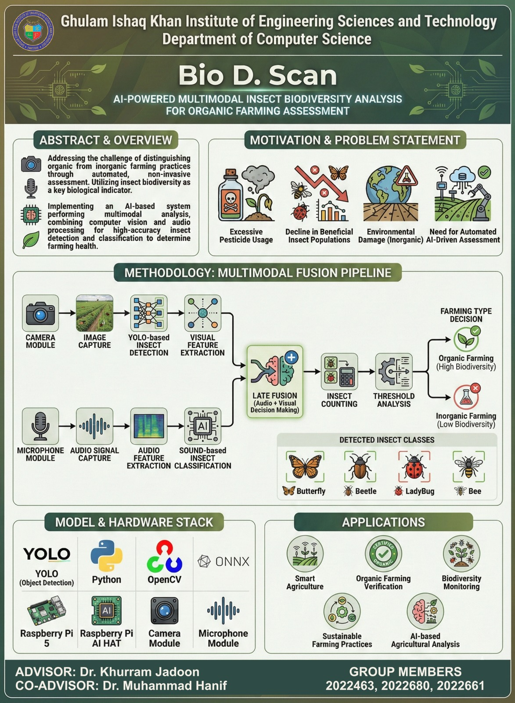

# 🐞 Bio-D-Scan — Multi-Modal Insect Detection & Classification System

> **Real-time insect detection, tracking, and classification** using edge AI on a Raspberry Pi 5 with Hailo AI HAT+ accelerator, combining computer vision and audio spectrogram analysis.

**Advisor:** Dr. Khurram Jadoon &nbsp;|&nbsp; **Co-Advisor:** Dr. Muhammad Hanif  
**Faculty of Computer Science and Engineering**  
**Phase:** Proof of Concept / Prototype  
**Author:** Muneeb Bin Nasir

---

## 📋 Poster

<p align="center">
  
</p>

---

## 📖 Overview

**Bio-D-Scan** is a multi-modal biodiversity monitoring system that combines **visual insect detection** (YOLO object detection) with **audio classification** (spectrogram-based CNN) for comprehensive insect identification. The system runs on a Raspberry Pi 5 equipped with a Hailo-8L AI accelerator (26 TOPS), enabling real-time inference at **~25 FPS** directly on the edge device.

### Key Capabilities

- **Real-time Detection** — YOLO-based insect detection running on Hailo AI hardware
- **Multi-Object Tracking** — Hungarian algorithm tracker with path recording, entry/exit detection, and movement analysis
- **Audio Classification** — Mel spectrogram-based CNN for insect sound identification *(in progress)*
- **Cloud Sync** — Automatic upload to Supabase with offline queue (store & forward)
- **Live Dashboard** — Streamlit web interface with species distribution, timelines, trajectory visualization, and session management

### Detected Species

| Class ID | Species    |
|----------|------------|
| 0        | Butterfly  |
| 1        | Beetle     |
| 2        | Ladybug    |
| 3        | Bee        |

---

## 🏗️ System Architecture

```
┌─────────────────────────────────────────────────────────────────┐
│                        Raspberry Pi 5                           │
│                                                                 │
│  ┌──────────┐    ┌──────────────┐    ┌────────────────────┐     │
│  │ PiCamera │───▶│  Hailo-8L    │───▶│  Insect Tracker    │     │
│  │   (RGB)  │    │  YOLO Model  │    │  (Hungarian Algo)  │     │
│  └──────────┘    │  ~25 FPS     │    └────────┬───────────┘     │
│                  └──────────────┘             │                  │
│                                               ▼                  │
│  ┌──────────┐    ┌──────────────┐    ┌────────────────────┐     │
│  │   Mic    │───▶│ Spectrogram  │───▶│   Cloud Upload     │     │
│  │ (Audio)  │    │  CNN Model   │    │   (Supabase)       │     │
│  └──────────┘    └──────────────┘    └────────┬───────────┘     │
│                                               │                  │
│                  ┌──────────────┐              │                  │
│                  │ Offline Queue│◀─── Fallback │                  │
│                  │ (Store+Fwd)  │              │                  │
│                  └──────────────┘              │                  │
└───────────────────────────────────────────────┼─────────────────┘
                                                │
                                                ▼
                                  ┌──────────────────────┐
                                  │   Supabase Cloud     │
                                  │  ┌───────────────┐   │
                                  │  │ PostgreSQL DB  │   │
                                  │  │   (Tracks,     │   │
                                  │  │   Sessions,    │   │
                                  │  │   Statistics)  │   │
                                  │  └───────────────┘   │
                                  │  ┌───────────────┐   │
                                  │  │ Object Storage │   │
                                  │  │  (Images)      │   │
                                  │  └───────────────┘   │
                                  └──────────┬───────────┘
                                             │
                                             ▼
                                  ┌──────────────────────┐
                                  │  Streamlit Dashboard  │
                                  │  (Real-time Charts,   │
                                  │   Trajectory Viewer)  │
                                  └──────────────────────┘
```

---

## 📁 Project Structure

```
BIO-D-SCAN/
├── README.md
├── .gitignore
├── yolo_training.ipynb              # YOLO model fine-tuning notebook
├── split_dataset.py                 # Train/Val/Test dataset splitter
├── yolo11n.pt                       # YOLO11n pretrained weights
├── yolov8n.pt                       # YOLOv8n pretrained weights
│
└── bio-d-scan/                      # Main application
    ├── main.py                      # Main detection loop (PiCamera2 + Hailo)
    ├── test_video.py                # Video-based testing (no camera needed)
    ├── labels.txt                   # Class labels (Butterfly, Beetle, Ladybug, Bee)
    ├── .env.example                 # Environment variable template
    ├── Poster.jpeg                  # Project poster
    ├── Audio Classification using Spectrograms.ipynb  # Audio model training
    │
    ├── models/                      # Compiled Hailo models (.hef)
    │   ├── insect_detector_yolov11n.hef
    │   ├── insect_detector_yolov8n.hef
    │   └── insects_detector_old.hef
    │
    ├── src/                         # Core modules
    │   ├── detector.py              # Hailo inference wrapper
    │   ├── tracker.py               # Multi-object tracker (Hungarian algorithm)
    │   ├── database.py              # Supabase upload + session management
    │   └── queue_manager.py         # Offline queue (store & forward)
    │
    ├── dashboard/                   # Web dashboard
    │   └── app.py                   # Streamlit dashboard application
    │
    └── queue/                       # Local queue for failed uploads
        └── *.json                   # Queued track data
```

---

## ⚙️ Hardware Requirements

| Component | Specification |
|-----------|---------------|
| **SBC** | Raspberry Pi 5 |
| **AI Accelerator** | Hailo-8L AI HAT+ (26 TOPS) |
| **Camera** | Raspberry Pi Camera Module (PiCamera2 compatible) |
| **Microphone** | USB microphone *(for audio classification)* |
| **Storage** | microSD card (32GB+ recommended) |

---

## 🚀 Getting Started

### 1. Clone the Repository

```bash
git clone https://github.com/your-username/BIO-D-SCAN.git
cd BIO-D-SCAN/bio-d-scan
```

### 2. Install Dependencies

```bash
pip install opencv-python numpy scipy picamera2 hailo-platform
pip install supabase python-dotenv
pip install streamlit pandas plotly            # For the dashboard
pip install ultralytics                        # For video testing / training
pip install librosa tensorflow scikit-learn    # For audio classification
```

### 3. Configure Environment Variables

```bash
cp .env.example .env
```

Edit `.env` with your Supabase credentials:

```env
PROJECT_URL=https://your-project.supabase.co
API_KEY=your-anon-key-here
DEVICE_ID=rpi5_01
```

### 4. Set Up Supabase

Create the following in your Supabase project:

- **Storage Bucket:** `insects` (public)
- **Tables:**
  - `tracks` — stores detection data (tracker_id, type, confidence, timestamp, image_url, path_points, distance_traveled, duration_seconds, entry_point, exit_point, frame_count, session_id)
  - `sessions` — stores monitoring sessions (device_id, started_at, ended_at, location, is_active, total_detections)
  - `statistics` — stores aggregated stats per session (session_id, insect_type, count, last_updated)
- **RPC Function:** `increment_session_detections`

---

## 🎯 Usage

### Run on Raspberry Pi (Live Camera)

```bash
cd bio-d-scan
python main.py -m models/insect_detector_yolov11n.hef -l labels.txt
```

This will:
1. Start the PiCamera2 with a live QTGL preview
2. Run YOLO inference on each frame via the Hailo accelerator
3. Track insects across frames using the Hungarian algorithm
4. When an insect leaves the frame, capture its best image with trajectory overlay
5. Upload the track data and image to Supabase (or queue locally if offline)

### Test with a Video File (No Camera Required)

```bash
cd bio-d-scan
python test_video.py --video path/to/insects.mp4 --model models/yolov8n.pt --display
```

Options:
- `--video` — Path to input video file
- `--model` — Path to YOLO model (`.pt` or `.onnx`)
- `--display` — Show live preview window
- `--conf` — Confidence threshold (default: 0.5)
- `--skip-upload` — Run locally without Supabase

### Launch the Dashboard

```bash
cd bio-d-scan
streamlit run dashboard/app.py
```

The dashboard provides:
- **Species distribution** pie chart
- **Detection timeline** area chart
- **Movement patterns** (entry/exit point analysis)
- **Trajectory viewer** with interactive path plots
- **Recent detections** table with images
- **Session filtering** and time range controls

---

## 🧠 Model Training

### Visual Detection (YOLO)

The training notebook ([yolo_training.ipynb](yolo_training.ipynb)) fine-tunes both **YOLO11n** and **YOLOv8n** on a custom insect dataset.

| Parameter | Value |
|-----------|-------|
| **Dataset Classes** | Butterfly, Beetle, Ladybug, Bee |
| **Dataset Split** | 70% Train / 20% Val / 10% Test |
| **Image Size** | 640 × 640 |
| **Epochs** | 100 |
| **Batch Size** | 16 |
| **Metric (mAP@50)** | **0.78** |
| **Inference Speed** | ~25 FPS on RPi 5 |

Trained models are exported to **ONNX** format and then compiled to **HEF** format for deployment on the Hailo-8L accelerator.

### Audio Classification (Spectrograms)

The notebook ([Audio Classification using Spectrograms.ipynb](bio-d-scan/Audio%20Classification%20using%20Spectrograms.ipynb)) trains a CNN classifier on insect sounds:

1. Audio files are converted to **Mel spectrograms** using `librosa`
2. Spectrogram images are fed into a **3-layer CNN** (TensorFlow/Keras)
3. The model classifies insect species from their sound patterns
4. Dataset: [InsectSound1000](https://www.kaggle.com/datasets/hesi0ne/insectsound1000) from Kaggle

> **Status:** Audio classification is functional. Multi-modal fusion (combining visual + audio predictions) is in progress.

---

## 🔍 Tracking Algorithm

The `InsectTracker` uses the **Hungarian algorithm** (via `scipy.optimize.linear_sum_assignment`) for optimal detection-to-track assignment:

1. **Cost Matrix** — Combines normalized Euclidean distance (60% weight) and bounding box area dissimilarity (40% weight)
2. **Track Lifecycle:**
   - **Created** when an unmatched detection appears
   - **Updated** when matched to a detection in the next frame
   - **Lost** when not matched for consecutive frames
   - **Finalized** when lost for `max_lost` frames (default: 20) and minimum distance traveled is met
3. **Class Voting** — Each frame's classification is a vote; the majority class across the track's lifetime is the final label
4. **Best Image** — The frame with the highest confidence score is saved as the representative image
5. **Path Recording** — Centroid history, entry/exit points, distance traveled, and duration are computed per track

---

## 📊 Dashboard Preview

The Streamlit dashboard ([dashboard/app.py](bio-d-scan/dashboard/app.py)) provides real-time monitoring:

| Feature | Description |
|---------|-------------|
| **Total Detections** | Count of insects detected |
| **Species Detected** | Number of unique species |
| **Avg. Confidence** | Mean detection confidence |
| **Avg. Track Duration** | Mean time insects are visible |
| **Species Pie Chart** | Distribution of detected species |
| **Timeline Chart** | Detections over time by species |
| **Entry/Exit Analysis** | Bar charts of movement directions |
| **Trajectory Viewer** | Interactive XY path plots per track |
| **Detection Table** | Detailed table with images and metadata |

---

## 🔄 Offline Queue System

When internet connectivity is unavailable, the system automatically queues failed uploads locally:

1. Track data and images are saved to the `queue/` directory
2. A background thread retries uploads every 60 seconds
3. Successfully uploaded items are cleaned up automatically
4. The queue persists across restarts

---

## 🛠️ Tech Stack

| Layer | Technology |
|-------|------------|
| **Hardware** | Raspberry Pi 5, Hailo-8L AI HAT+ (26 TOPS) |
| **Camera** | PiCamera2 |
| **Object Detection** | YOLO11n / YOLOv8n (Ultralytics) |
| **Model Runtime** | Hailo Runtime (HEF format) |
| **Tracking** | Custom Hungarian Algorithm Tracker (SciPy) |
| **Audio ML** | TensorFlow / Keras CNN + Librosa |
| **Backend** | Supabase (PostgreSQL + Object Storage) |
| **Dashboard** | Streamlit + Plotly |
| **Language** | Python |

---

## 📄 License

This project is developed as part of an academic final year project at the Faculty of Computer Science and Engineering.

---

## 🙏 Acknowledgments

- **Dr. Khurram Jadoon** — Project Advisor
- **Dr. Muhammad Hanif** — Co-Advisor
- [Ultralytics](https://github.com/ultralytics/ultralytics) — YOLO models
- [Hailo](https://hailo.ai/) — Edge AI accelerator platform
- [Supabase](https://supabase.com/) — Backend-as-a-Service
- [InsectSound1000 Dataset](https://www.kaggle.com/datasets/hesi0ne/insectsound1000) — Audio classification dataset
